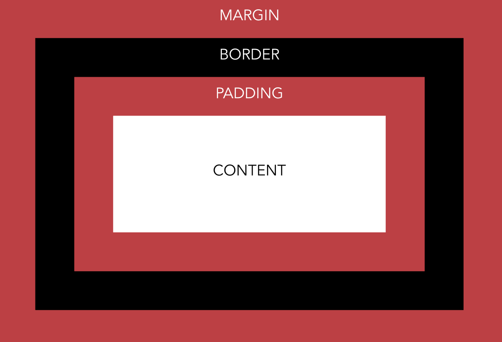

# Blueprint Web Basics Workshop

In this workshop, you will get your hands dirty by creating and editing HTML files. Download this repository to your computer, then work through the following steps.

Below you will find **ACTIONABLES**. These are things that you should do in order to complete this workshop. For a lot of these tasks, it will not be very straightforward how you are supposed to do them. The goal of this workshop is for you to be able to look things up on your own online and figure out the solutions. 

## **Step 1:** Read Through the `head` Tag

The `head` tag in this HTML file contains some tags that we didn't go through. Read through the description to familiarize yourself with those new tags.

At the bottom of the `head` tag, you'll notice that the CSS file is not linked. 

**ACTIONABLE:** Link the CSS file that is located in the folder `/css/style.css` to your HTML so that your HTML can use the styling from the CSS file.

To check if your file worked, notice that the font will change from *Times New Roman* to *Helvetica*.

**NOTE:** You will find another css file (`/css/solution.css`). DON'T open this file unless you want to cheat into the solution. We can look at the solution together later on. 

After that, ignore the CSS for now. We will get back to it later.

## **Step 2:** Read Through the `body` Tag

Read through the HTML to understand that it's doing. When you're done, you can open the file to see what it's like. This will open with your default browser. If it's not Chrome, choose to open it with Chrome (and maybe set it as your default browser).

**ACTIONABLE:** At some point in the HTML, it says "Robert Vunabandi". Change that to your name and where you are from instead.

**ACTIONABLE:** Change the unordered list to display the things that you like.

**ACTIONABLE:** Now, add an *ordered list* to the HTML where it says so.

Once done, refresh to page to see the update.

## **Step 3:** CSS Time

We're gonna spend the bulk of this workshop in CSS. Let's play around with multiple things.

### Open `/css/style.css`

You notice that we have the following inside this css file:

```css
* {
	font-family: helvetica;
}

```

This is a CSS Selector that selects every single elements and applies the styling within that block to every HTML element on the page. 

Inside the [CSS Selectors from W3Schools](https://www.w3schools.com/cssref/css_selectors.asp), they show you how to do more fancy types of selections. 

**ACTIONABLE:** Using the W3Schools' CSS Selector guide, select every `span` that are inside every `p` tag and make them bold. 

---

Now, let's add some color and shape to our website.

**ACTIONABLE:** Make all `h1` elements blue.

**ACTIONABLE:** Make all texts centered.

Refresh the page to see the changes!

---

Now, it's time to learn about CSS's box model. Remember how every element in the HTML is a box? Well, each of those elements have the following:

- **Margin:** The space between what's outside the box and its border
- **Border:** The border of the box
- **Padding:** Space between what's inside the box and its border



Each of those properties of the box can be edited.

- **Margin:** 
  - The margin can have a size. 
  You can edit the left, right, top, and bottom margins separately.
- **Border:** 
  - The border has the same properties as margin, but with more.
  - This is the only property that has a radius (with `border-radius`) and color (with `border-color`).
- **Padding:** 
  - The padding is similar to margin in terms of its properties.

Each of these can have even more properties. Play around with them.

**ACTIONABLE:** Make the padding of the `body` 20 pixels.

--- 

This is a good time to introduce [CSS units](https://www.w3schools.com/cssref/css_units.asp). CSS uses both absolute and relative units. 

Absolute units are units that don't change regardless of the location. For instance, a meter in the US is the same exact meter in South Africa. So, the meter is an absolute metric. CSS has its own set of absolute metrics (see the link above).

CSS also has relative ones. These are metrics that depends on many things. Some of them depend on the width or height of the browser window, some depend on the default size of the browser window, and some depend on the parent html elements. The `rem` depends on the browser's default size, which can be edited by the users. It may be worth also looking at [the difference between `rem` and `em`](https://j.eremy.net/confused-about-rem-and-em/) (where `em` is kind of a close relative of `rem`).

**ACTIONABLE:** Change the font size of the `p` elements to be `1.2rem`.

---

Backgrounds are great to play with. There are two things that can go with backgrounds: colors and images. CSS uses a set of predefined colors (such as `red`, `blue`, etc), and also more standard color values such as `HEX`, `HSL`, and `RGB`. It even has `HSLA` and `RGBA` where the `A` stands for `alpha` (in other words, opacity). These are more useful to gain access to a much wider range of `8-bit` colors. 

What we can also do is set the background as an image. Look up online how to do that.

**ACTIONABLE:** Set the background as the mountain image that you can find inside `/assets` directory. Set it using the CSS. 

--- 

Now, use your imagination to do even more tricks using CSS. You can literally do anything! Try the following:

**ACTIONABLE:** Add another HTML page to this website and create a link to it back and forth. 

**ACTIONABLE:** Add some shadow. You have the `text-shadow` and `box-shadow` properties to mess around with.

**ACTIONABLE:** Animate the page using `transition` and other CSS selectors (such as the `:hover` or `:focus` selector).

**ACTIONABLE:** Add some padding and margin here and there. Is there anything you notice about margins and paddings?


## **BONUS:** Get Even Dirtier!

**ACTIONABLE:** Use [Google Fonts](https://fonts.google.com/) to pick and use an even cooler font in your website. 

---

Have you heard of [Bezier' Curves](https://en.wikipedia.org/wiki/B%C3%A9zier_curve)?

**ACTIONABLE:** Try the following CSS edit to an element of you choice (must have display as `inline-block` or `block` to work). Make sure to replace `selector` with the element of your choice.

```css
selector {
	padding-left: 20rem;
	transition: all 2s;
	transition-timing-function: cubic-bezier(0.1, 0.7, 1.0, 0.1);
}
```

---

Did you know you could create CSS variables? 

**ACTIONABLE:** Define variables `--primary-color`, `--secondary-color`, and `--tertiary-color` using [CSS variables](https://developer.mozilla.org/en-US/docs/Web/CSS/Using_CSS_variables) and use only those variables in your CSS instead of using colors directly. 
